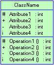
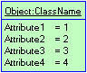
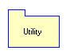
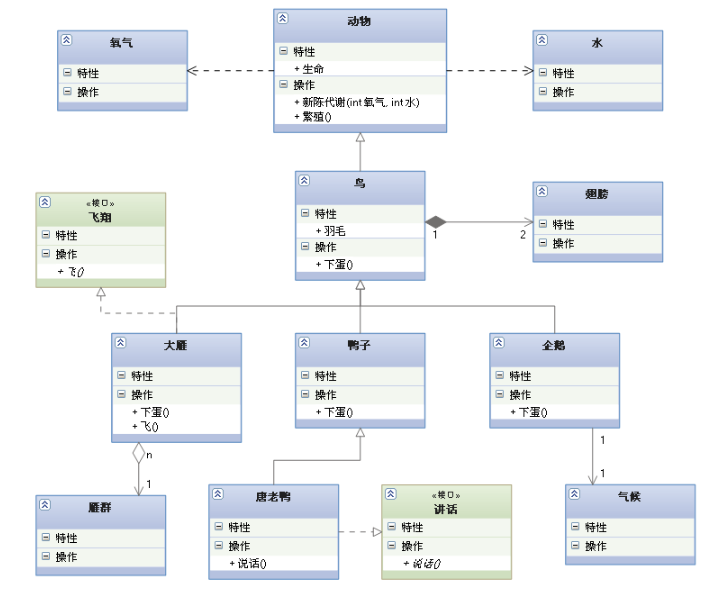
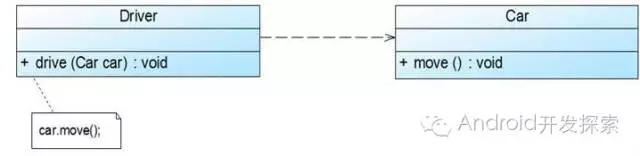
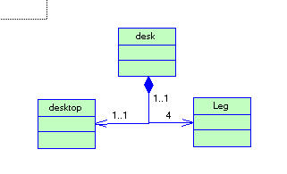
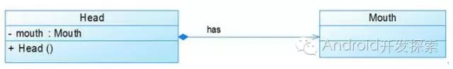

# UML

### 结构元素

结构元素包括，类，对象，接口，用例，参与者。

##### 类图

类图图示

   类图是UML中最基本的元素了吧？根据OO的思想“天下一切皆对象”，而类是对象的抽象。 
   左侧图示为一个类图。顶端“ClassName”表示类名 
   中间部分为该类的属性，其中分别表示为可访问性，属性名，以及属性的数据类型。 
   第三部分为该类的方法，包括方法的可访问性，方法名，方法的参数以及方法的返回值。 
   需要说明的是：

- ​     “#”表示protected 
  ​     “+”表示Public
  ​     “-”表示private
  ​       “i”表示internal(内部的)

##### 对象图

右侧图示为一对象图，该对象为类className类的一个实例对象

该图第一部分说明了该对象为className的一个实例，第二部分指定了该实例的属性值。该图指定的是一个特殊的实例的对象，如果要代表className的所有的对象可省略掉对象名，即为“:ClassName”。

##### 接口

左图为一个比较简单的接口事例图示。与类图差不多，该图示分为三部分，第一部分为接口名，为了更明确的标明其“接口”的身份通常以“I”开头。第二部分为属性，第三部分为方法。

 

##### 用例与参与者

下图为一简单的用例视图。小人表示参与者，而椭圆表示的是用例。

##### 包

右侧图示为一包图，该图示为一名称为Utility的工具包。

包用来组织类，被包含在包里的类一般通过如Utility::StrUtility的形式来反应该类的路径。

### 类和类之间的关系

*各种关系的强弱顺序：*

泛化 = 实现 > 组合 > 聚合 > 关联 > 依赖

---->
->

◇->6

◆->

--▷
-▷

#####  1、依赖关系---->

==虚线==

从上图我们可以看到，Driver的drive方法只有传入了一个Car对象才能发挥作用，因此我们说Driver类依赖于Car类。在UML类图中，依赖关系用一条带有箭头的虚线表示。

 

##### 2、关联关系->

   关联是类之间的联系，如篮球队员与球队之间的关联（下图所示）。其中，关联两边的"employee"和“employer”标示了两者之间的关系，而数字表示两者的关系的限制，是关联两者之间的多重性。通常有“*”（表示所有，不限），“1”（表示有且仅有一个），“0...”（表示0个或者多个），“0，1”（表示0个或者一个），“n...m”(表示n到m个都可以),“m...*”（表示至少m个）。
   在关联中有一种叫“限定关联”，还有一种谓之自身关联。另外，对象之间的关联就没那么复杂，只是将类的关联实例化而已。

关联关系又可进一步分为单向关联、双向关联和自关联。

 

自关联在UML类图中用一个带有箭头且指向自身的直线表示。上图的意思就是Node类包含类型为Node的成员变量，也就是“自己包含自己”。

##### 依赖vs关联的区别：

1）从类之间关系的强弱程度来分，关联表示类之间的很强的关系；依赖表示类之间的较弱的关系；
从类之间关系的时间角度来分，关联表示类之间的“持久”关系，这种关系一般表示一种重要的业务之间的关系，需要保存的，或者说需要==“持久化”==的，或者说需要保存到数据库中的。比如学生管理系统中的Student类和Class（班级）类，一个Student对象属于哪个Class是一个重要的业务关系，如果这种关系不保存，系统就无法管理。另外，依赖表示类之间的是==一种“临时、短暂”==关系，这种关系是不需要保存的，比如Student类和StuEditScreen（学生登录界面）类之间就是一种依赖关系，StuEditScreen类依赖Student类，依赖Student对象的信息来显示编辑学生信息。
2）设计类之间的关系是遵循的原则：首先判断类之间是否是一种“关联”关系，若不是再判断是否是“依赖关系”，一般情况下若不是关联，就是依赖关系
3）依赖一般情况下是以下几种情况之一：a、ClassA中某个方法的参数类型是ClassB；这种情况成为耦合；b、ClassA中某个方法的参数类型是ClassB的一个属性；这种情况成为紧耦合；c、ClassA中某个方法的实现实例化ClassB；d、ClassA中某个方法的返回值的类型是ClassB；如果出现了上述四种情况之一，两个类很有可能就是“依赖”关系。
4）依赖关系（Dependency）：是类与类之间的连接，依赖总是单向的。依赖关系代表一个类依赖于另一个类的定义。下面的例子中class A 依赖与class B、C、D。

##### 3、聚合关系◇->

==箭头聚合成菱形==

一个类可能有几个部分类聚集在一起而成。如：电脑主机由CPU，主板，光驱....等组成。类与类之间是“整体-部分”的关系。

上图中的Car类与Engine类就是聚合关系（Car类中包含一个Engine类型的成员变量）。由上图我们可以看到，UML中聚合关系用带空心菱形和箭头的直线表示。聚合关系强调是“整体”包含“部分”，但是“部分”可以脱离“整体”而单独存在。比如上图中汽车包含了发动机，而发动机脱离了汽车也能单独存在。

##### 4、组合关系◆->

 ==强聚合 实心==

组成是强类型的聚集，每个部分体只能属于一个整体。如桌子由桌腿和桌面组成。

组合关系与聚合关系见得最大不同在于：这里的“部分”脱离了“整体”便不复存在。显然，嘴是头的一部分且不能脱离了头而单独存在。在UML类图中，组合关系用一个带实心菱形和箭头的直线表示。

##### 6、实现关系--▷

==弱继承虚线==

| ==空三角== | ==#==                |
| ---------- | -------------------- |
| 表示继     | 表示受保护给之类继承 |

这种关系对应implement关键字，在UML类图中用带空心三角形的虚线表示。如下图中，Car类与Ship类都实现了Vehicle接口。

##### 5、泛化关系-▷

 继承关系对应的是extend关键字，在UML类图中用带空心三角形的直线表示，如下图所示中，Student类与Teacher类继承了Person类。

# 设计模式

