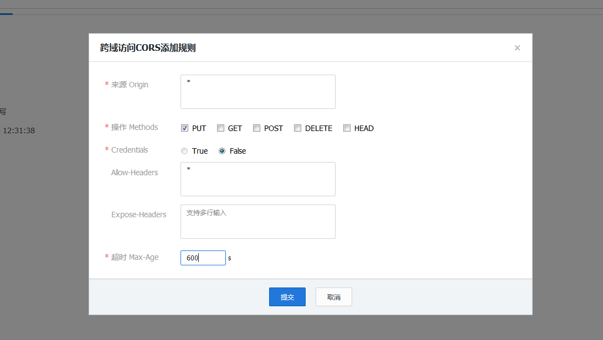

## 创建新站点的步骤
        1，chmod -R  777 /alidata/www
        2，域名解析
        3 vhost文件
        4重启service nginx restart
        如果是新服务器看是否设置了安全组(设置linux的端口)

## 重启nginx
     service nginx restart
     或
     /etc/init.d/nginx restart
## 虚拟主机配置文件文件

        localhost {
                listen       80;
                server_name  localhost;
            index index.html index.htm index.php;
            root /alidata/www/localhost;
            location ~ .*\.(php|php5)?$
            {
                #fastcgi_pass  unix:/tmp/php-cgi.sock;
                fastcgi_pass  127.0.0.1:9000;
                fastcgi_index index.php;
                include fastcgi.conf;
            }
            location ~ .*\.(gif|jpg|jpeg|png|bmp|swf)$
            {
                expires 30d;
            }
            location ~ .*\.(js|css)?$
            {
                expires 1h;
            }

        }
## 跨域
添加到虚拟主机配置文件里跨域

    location ~* \.(eot|ttf|woff|svg|otf)$ {
         add_header Access-Control-Allow-Origin *;
    }

    location / {
      add_header Access-Control-Allow-Origin *;
    }

## 腾讯云跨域

