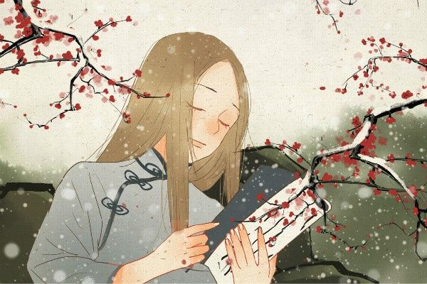

# 原则

### 定义

情绪的行为模式

### 比较

| 习惯           | 原则           |
| -------------- | -------------- |
| 日常的行为模式 | 情绪的行为模式 |

### 为什么要有原则

生活中，为人太过善良，会被欺负；太过为人着想，也常常被认为是自作多情。有人说，人生就像一场生意，并不是你付出了，就一定会有回报，有时更要承担被人坑骗的后果。并不是你做的有什么不对，而是社会有时太残酷，人心有时太冷漠。自古，多情总被无情伤，忠义常被奸诈害。你的无私往往换来了他人的自私，你的真心常常遇不到他人的实意。

### 具体原则

##### 对待他人

做人，要有自己的底线。人这一生，不怕冷淡就怕被伤害。伤人心的事不能做，伤人的话不能说。人，不能只在乎自己，不在乎别人。伤人就是伤己，爱别人就是爱自己！

守好嘴，走好路，自尊自爱，活得有尊严。心与心之间诚信为本，对秘密守口如瓶，对朋友信任不变，信任你的人不辜负；你信任的人不敷衍，认真守住自己的底线。 不骗人，不负人， 顶天立地，做一个好人！

为人，别触碰别人的底线。说话别戳短，否则会令自己难堪。朋友别拆穿，否则会让自己没有伙伴。这个世上的我们，你有你的选择，我有我的骄傲。你有你的决绝，我有我的凛冽。

人人都有原则，请别轻易违反。人人都有尊严，请别肆意践踏。人心换人心，才能暖。善待换情义，才能远。互相尊重，互相理解，互相体谅，互相忍让，才能有人伴，有心念！

做人，有原则，有底线身处在逆境，也不乞求人怜悯人居在高位，也不瞧不起别人。心有宽度，人生才有厚度，被人欺骗过，也不伺机报复；被人伤害过，也不一蹶不振，心有忍让，才会有肚量。

##### 防御别人

做人要有自己的底线，坚守自己的尊严。

能接受批评，但要拒绝侮辱；

可以不被重视，但要杜绝藐视；

不怕有人误解，但绝不能让人泼脏水；

能接受当面指责，但绝不允许背后使诈。

没有规矩，不成方圆；没有底线，就会失去尊严。

底线的最低表达就是脾气，底线的最高表达就是无视。

### 为人处事的智慧：有度量更有底线

我们都喜欢和大气的人做朋友，为什么？

好说话，好办事，不去计较一些需要“细琢磨”的边边角角。

跟这样的人做朋友，很舒服，也很简单。

但想要做到这些事情，其实并不简单：

毕竟，能够把别人与自己的利益进行合理的权衡，这往往需要一些为人处事的智慧。

一、有度量，就是有能量

人们都希望自己在群体中获得一种认可：

那就是影响力。

什么是影响力？

有影响力的人说的对，一呼百应。

没影响力的人说的对，孤掌难鸣。

影响力在交际中的意义，轻则获取信任，重则影响局势。

这也就是为什么有影响力的人，如果他心地善良，会对一个集体造成积极的影响，而如果他心肠肮脏，便可以随意陷害他人，对他人的声誉造成破坏性的影响。

好了，我们说了影响力，那么有度量跟影响力有什么关系呢？

度量，是产生影响力的先决条件。

为什么呢？因为无论你想建立何种情况的交际关系，首先，你要让对方认可你。

而你想让对方认可，首先的首先，是示好。

中国有句老话：“伸手不打笑脸人。”示好的意义，就是在你们不清楚彼此的各种情况之前，先用积极的因素去影响对方。

而示好的核心，就是用自己的度量，去鼓励对方的好，去宽容对方的不好。

并且这其中，很有可能会跟进许多附加的条件（比如一些好处，一些谋取信任的套路等等）最终对方在评价你的时候，你最基础的交际优势，就是你的度量（在这之上，对方可能还有其他评价，这就要看你之后的互动所产生的影响了）

度量这个东西，为什么代表了一个人的能量？

比如对比来说，一个人聪明、会说话、开车稳、打网游很好等等，这都是一个人的外显优势。

而度量，是一个人的内有优势。

外显优势，是主动的表现；而内有优势，是一个人固在的本事。

内有优势相对于外显优势，更具备感染力，这种感染力上升到社交关系之中，就容易成为一种影响他人的能量：

这种能量，会容易被理解为是一种基于人格的魅力。

二、人因底线的不同，而区别于他人的存在

其实真正有度量的人，都有底线。

只有那些为了有度量而显得有度量的人，才没有底线。

这就好比什么呢？

有些人你给他们提建议，说道理，他们听，但是他们不思考，他们为了表现出有度量，而放弃了有度量的表现。

所以，底线的存在，就显得尤为重要了。

底线的最低表达就是脾气，底线的最高表达就是无视。

我们需要脾气，但往往很难驾驭脾气，所以底线的最低表达就是脾气，有脾气，说明你明白自己不能接受的问题是什么，这些问题是怎么来的，进而你开始通过脾气去了解自己，但却因为脾气而失去更好表达自己的机会。

所以，有脾气是没错的，但如果能控制住脾气，你的人生往往会更容易被掌控。

而底线的最高表达就是无视。

做到真正意义上的无视，其实是一件很难的事情。

为什么难呢？因为第一你要有足够的自信，第二你要有足够的知识和经验去支撑你的自信。

比如有个人把你说的一无是处，强行给你扣一个恶心你的帽子。

你想无视对方，第一就是你明白对方说的话毫无意义可言，你的自信，就是对自己的最好证明。

其次，你的自信要有据可循，你有足够的经验证明对方只不过是嫉妒你的才华才去指责你的存在，你有足够多的知识证明，对方给你扣帽子是毫无意义的强调，是很荒唐的举动。

这些，说到底都是历练。

所以我说，做人有底线，为什么要有底线？不仅仅是你生活态度的问题，

也是你几经锤炼之后，在面对矛盾和问题时，最能够考验你的表现。

三、为人处事的智慧，源于生活，高于生活

我曾经不止一次的被现实朋友和网上的粉丝问这样一个问题：

大岛，你不是什么职业精英，也并非什么权威存在，你凭什么就说你活的比别人明白？

我想，这个问题最好的答案，不在我的文章之中，而在我的表达之外。

这是什么意思呢？

比如我今天这篇文章讲的是我对度量和底线的理解，这是我们通过阅读能够获得的信息，

但是这层表达之外，其实更多的是一种人与人智慧上的交锋。

人，没有立于不败之地的时候，你总要被打败，总要受到挫折。

所以，在你没有度量的时候，你承受失败的勇气，就是你自己对你自己最大的度量。

而当你开始慢慢成长，慢慢成为一个你期望的人时，你也会面对挑战，当你能够击败那些渺小而愚昧的反对者时，

你的底线，就是你做人的操守。

还记得我文章开始阶段，我是如何形容那些有影响力的人吗？

他们可以做对的事情，也可以做错的事情。

对的事情，是我们认为对我们有好处的事情。

错的事情，是我们认为对我们没有好处或是有坏处的事情。

但如果一个人真的具备影响力时，

他还会在乎“我们”的想法吗？

也许，这又是一个值得“咱们”思考的问题。

所以，那些为人处事的智慧，

源于生活，是一种基于经验的经验之谈。

而高于生活的那部分，

则是领悟之外的领悟