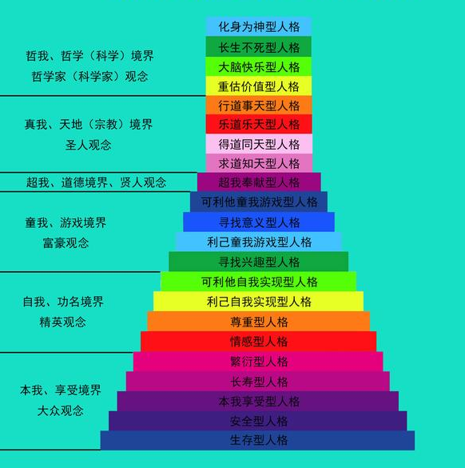

## 情绪

叔本华的钟摆理论是指：人在各种欲望（生存、名利）不得满足时处于痛苦的一端；得到满足时便处于无聊的一端，人的一生就像钟摆一样在这两端之间摆动。

如何才能打破叔本华的“钟摆理论”魔咒呢？我认为，必须找到自己的真兴趣，并尽可能地创造条件去做自己感兴趣的事情。

快乐是短暂的 痛苦是短暂的 无聊是永恒的 追求快乐是永恒的 ,担心在有的人那里也是永恒的

人生只有两件事 追求快乐和赚钱, 其他都是庸人自扰,.

做一件事就既有好处又有坏处,只想坏处就会悲观,只想好处就会乐观,例如博学有博学的好处,博学也有博学的坏处,唯心而已,,想做什么就做什么,现实需要什么,就做什么

忍受痛苦，不逃避痛苦，走向美好，这才是人的终极解脱

不劳累就是无聊 无聊即抑郁和焦虑  这就是痛苦 就是地狱

人生各种状态下滑,人就会出现短暂的痛苦.适应就好

真正的痛苦并非失去本身,而是对失去的担忧和失去后的自责和惋惜

真正的快乐并非得到本身,而是在奋斗过程的中的全身心的投入和无我的劳动

### 正面情绪

#### 自信

#### 兴趣

#### 求知欲

#### 开心

为获得知识而开心

### 负面情绪 痛苦

##### 恐惧 焦虑 担心

战胜这个恐惧

担心是让自己提前去体验未来不一定发生的痛苦.

中国人缺乏安全感 操纵爱自己的人才会觉得有安全感

接受现在的自己,  每前进一步都是进步 ,每前进一步都是快乐

##### 悲伤

为失去星星而哭泣的时候  ,可能正在失去月亮

失去的 就失去了吧 再赚回来

###### 以得代失

在意名声无非是在意别人怎么看自己

人若过度在意名声,就会畏首畏尾不敢出手,出手也有心理压力怕丢了名声

还会为了隐藏自己做无用功

