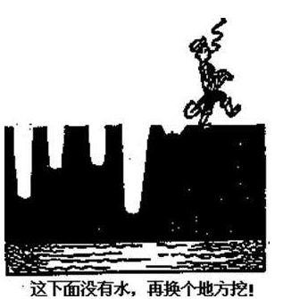

## 目标

### 目标的优先级 确定主目标

这个世界没有两全其美的事情

想赚钱就要牺牲安逸,想提升学习就必须放弃一些玩乐的时间

想有女朋友就要牺牲自由、金钱、体力、耐心和忍受女生的各种怪异的行为

人生就是在做选择，选择就是用失去的交换获得的

### 目标替代情绪化

以目标的为准则。指不受情绪影响，注重于实现自己目标的生活态度。例如买东西，不论当时心情如何，把东西买回来就是成功。要努力创造一种方法，尽量抛弃以情绪为准则的生活态度。

管住自己的嘴巴和行为，不做因为情绪化和目标相违背的事情,

例如要爱情， 就不要抱怨，  一切为了两个人能在一起,最怕的就是一边付出，一边抱怨和伤害。

##### 努力做事而不是用紧张情绪表示自己努力

战略上重视敌人,心理上藐视敌人
行为上努力学习，心理上把高考的结局交给老天，高考结果是很多因素决定的，并非只是你的努力，你能做的就只有努力学习，做到了努力学习，即使失败也无怨无悔了

尽人事 安天命

### 目标要先确定详细的标准

比如 ：

每天看多少页书，做多少题，完成多少工作

### 决定下来的事,不要改变

##### 改变是在浪费自己的人生

一件事情尝试去做,觉得困难就想放弃,觉得困难消失了又想坚持,就像多处挖井一样,浪费很多时间、精力和金钱

随着事态发展更改目标,容易半途而废,比如我要和谁谈恋爱,投入多少,觉得有戏就投入 ,觉得没戏就不谈了

##### 改变影响信誉

一言九鼎，做一个信誉度高的人，提升人格魅力

##### 朝令夕改会下属无所适从

朝令夕改的领导 无法令人信服，员工经常观望领导是否还修改

### 到了山穷水尽时间再放弃

一个人习惯了坚持，放弃就需要莫大的勇气和智慧，比坚持目标更难