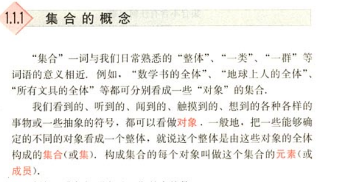
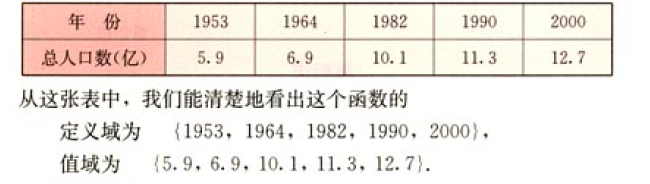
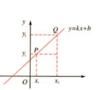
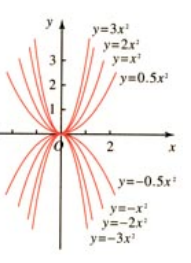
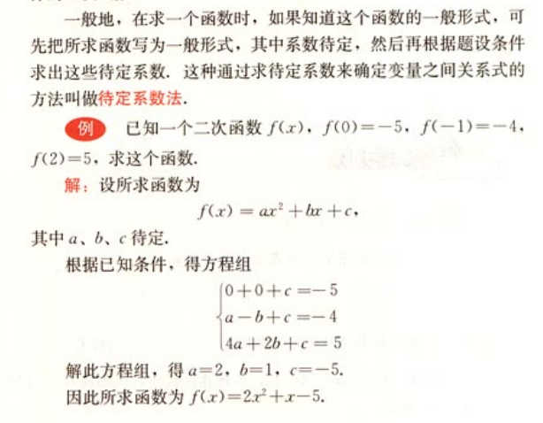
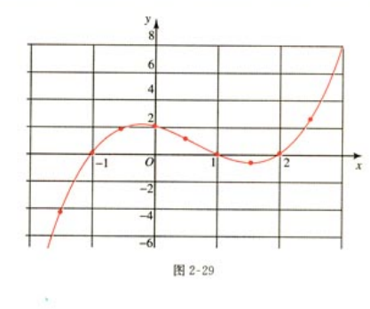

## 命题定理证明

命题: 能判断真假的语句 分真命题和假命题

定理: 又命题推论而来的

证明:推论的过程

## 集合

## 函数 (列表 公式 图形 ) 方程 关系

### 一次函数

##### 列表

##### 公式和方程

| 函数公式  | 方程                            |
| --------- | ------------------------------- |
| f(x)=2x+1 | f(x)=3时,    2x+1=3 ,x=1 一个值 |

##### 图形

### 二次函数

| 函数                | 方程                                                         |
| ------------------- | ------------------------------------------------------------ |
| f(x)=2x2 | f(x)=8时,     8=2x2  , x=+2或-2    二个值 |

### 二次函数2

### 三次函数

| 函数                               | 方程                                                         |
| ---------------------------------- | ------------------------------------------------------------ |
| f(x)=x3+x2+1 | f(x)=0时,      x3+x2+1=0   x得到 三个值 |

